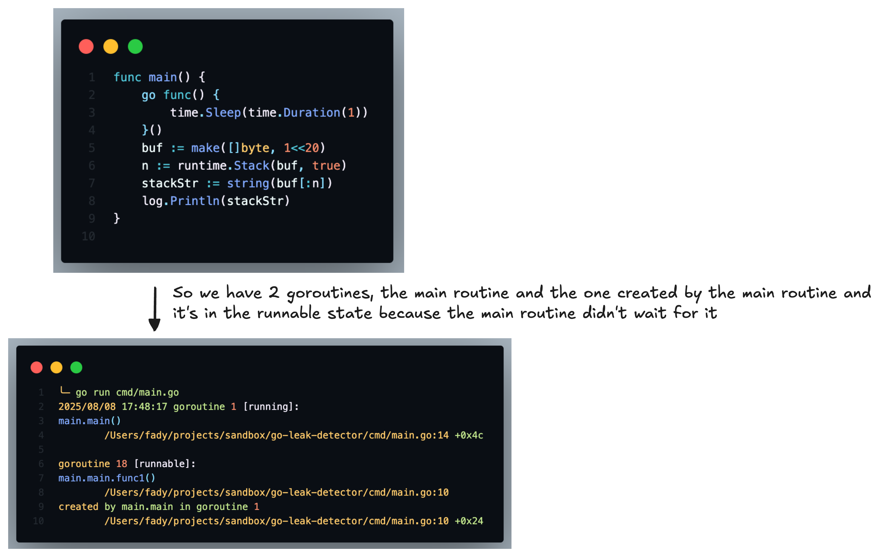

# Functional Requirements:
1. **Real-time Gouroutine tracking**: track number of active goroutines and trace their stacks overtime.
2. **Leak Detection**: detect goroutines leaks (maybe blocked waiting for channel, sync primitives, etc).

# Explanation of the model : 
